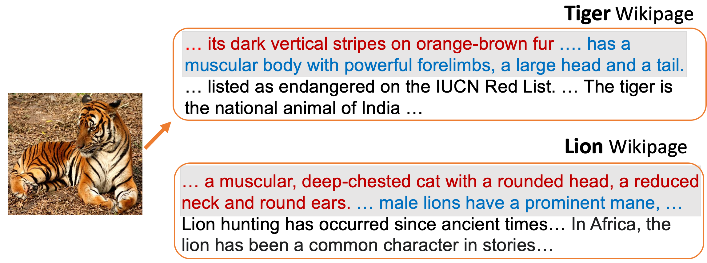

# Revisiting Document Representations for Large-Scale <br/> Zero-Shot Learning

Official implementation for the paper [Revisiting Document Representations for Large-Scale Zero-Shot Learning](https://arxiv.org/abs/2104.10355) <br/> by Jihyung Kil, Wei-Lun Chao, NAACL 2021.

<p align="center">
  </center>
</p>

## Dataset
#### Wikipedia Documents
The (non-) filtered Wikipedia sentences are available on [here](https://drive.google.com/drive/u/0/folders/1oFo4CsYcU0t7EOb9DwJX26JQgT_i9BIw). Please read the related README for more details.

#### Semantic Representations
To extract the semantic representations from the (non-) filtered sentences, run

```
CUDA_VISIBLE_DEVICES=0 python3 get_sem_rep.py --wiki_set data/21k_true_wiki_sents_vis_sec_clu --pool avg_pool --flt vis_sec_clu --max_seq_len 64 --max_sent all
```
#### Visual Features
We use 2,048-dimensional ResNet visual features(He et al., 2016) provided by(Xian et al., 2018a) [here](https://www.mpi-inf.mpg.de/departments/computer-vision-and-machine-learning/research/zero-shot-learning/zero-shot-learning-the-good-the-bad-and-the-ugly)

## Code
We leverage three Zero-Shot Learning models on our experiments:
* DeViSE (Frome et al., 2013): DeViSE and DeViSE<sup>*</sup> are based on the implementation from [here](https://github.com/TristHas/GOZ).
* EXEM (Changpinyo et al., 2020): We use its official implementation available on [here](https://github.com/pujols/Zero-shot-learning-journal).
* HVE (Liu et al., 2020): The official implementation can be found on [here](https://github.com/ShaoTengLiu/Hyperbolic_ZSL).
